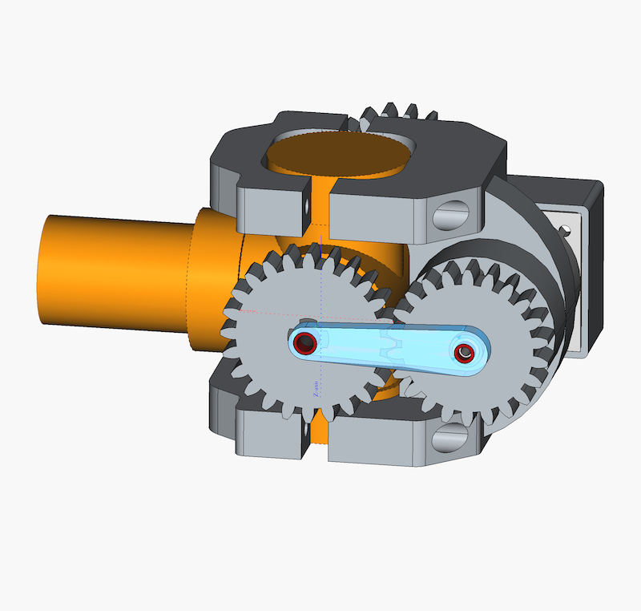
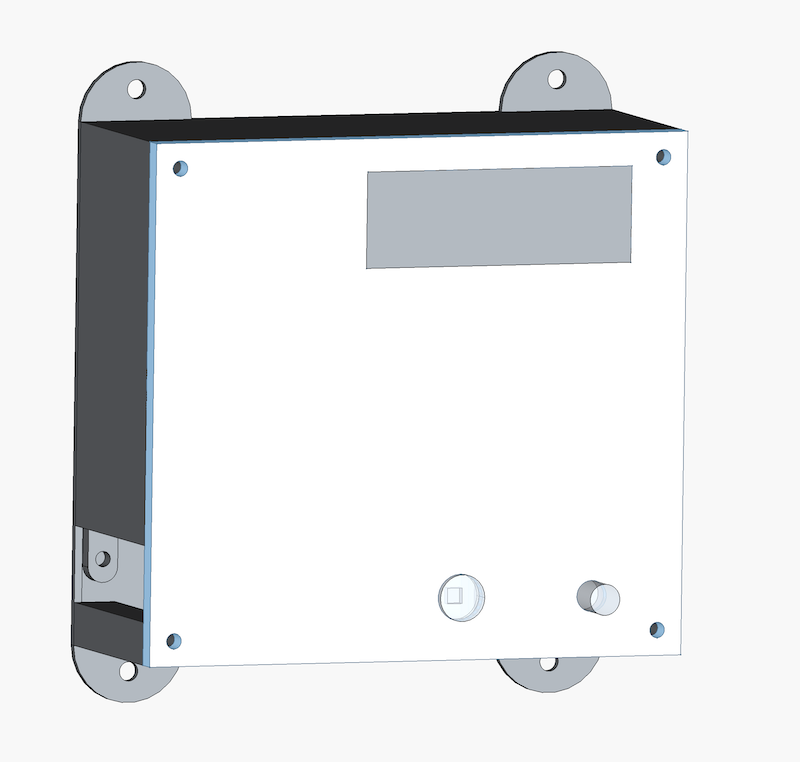

# Arduino ESBE VRG131 Valve  Motor Controller

A custom firmware implementation for controlling stepper motors using an **Arduino Uno** and **CNC Shield V3**

## 🔧 Hardware Setup

* **Controller:** Arduino Uno + CNC Shield V3.
* **Drivers:** A4988 / DRV8825 (verified with active-low logic).
* **Motors:** NEMA 17 Stepper Motors.
* **Interface:** Rotary Encoder (KY-040 type) with Push Button.
* **Power:** 12V/24V external power supply for shield.

## 🚀 Key Features

* **Independent A-Axis:** Configured the 'A' slot on the CNC shield as an independent axis (Pins 12/13) by removing hardware clone jumpers.
* **Smart Power Management:** Implements "Auto-Enable" logic; drivers hold torque only during movement or menu interaction, and disable (idle) to reduce heat when inactive.
* **Debounced Interface:**
* **Hardware:** None
* **Software:** Non-blocking `millis()` based debounce logic for the button and Interrupt-based handling for the encoder.

## 🛠 Configuration Notes

* **Jumper Settings:** Remove **EN/GND** jumper cap from shield to allow software control of motor enable. Remove **X/Y/Z Clone** jumpers to isolate the A-axis.
* **Jumper Settings:** Install **A12** jumpers to control A axis
* **Pinout:**
* **Z-Axis:** Step (4), Dir (7)
* **A-Axis:** Step (12), Dir (13)
* **Global Enable:** Pin 8 (Active LOW)
* **Encoder:** Pin A2 & A3
* **Button:** Pin A1
* **Endsotps** Pins D11 and D9
* **Temperature sensors** Pin A0

## 📦 Dependencies (PlatformIO)

This project uses the following libraries:

* `waspinator/AccelStepper` (Motor control)
* `paulstoffregen/Encoder` (High-performance encoder reading)

---

### 📝 To-Do / Known Issues

* Ensure the driver Vref is calibrated to match motor current limits.
* If using Pin 12, ensure no SPI conflict if adding displays/SD cards later.

---

### ⚙️ 3D Models (FreeCAD) to print CASE and mount parts included
#### Mount parts

 

#### Case

 