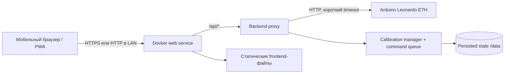

# План разработки Docker web-приложения для Boiler Regulator

Статус: **готов для передачи другой модели; выбран дизайн A «Домашняя панель»**.
Тема по умолчанию — auto, если владелец не задаст другую.

## 1. Цель

Создать мобильное web-приложение, запускаемое одним Docker Compose сервисом в
домашней сети. Приложение получает состояние Arduino Leonardo ETH, показывает
четыре температуры, калибрует логическую шкалу клапанов и позволяет отправить
первый или второй клапан к физическому пределу `MIN`/`MAX` либо установить
произвольное открытие от 0 до 100%.

Первый релиз должен быть простым, надёжным и безопасным от случайных повторных
команд. После перезапуска Arduino прежняя абсолютная шкала считается
недействительной и backend заново выполняет калибровку. История температур,
расписания, автоматическое регулирование и удалённый доступ через интернет не
входят в MVP.

## 2. Что уже есть в прошивке

Источник: `controller/src/main.cpp`.

### 2.1 Чтение состояния

`GET http://<controller-ip>/status`

Текущий ответ:

```json
{
  "fl1": 21.5,
  "fl2": 22.0,
  "boiler": 24.5,
  "room": 61.0,
  "m1": 100,
  "m2": 9900
}
```

Рабочее отображение для MVP, которое нужно подтвердить на реальном устройстве:

| Поле Arduino | Подпись в приложении |
| --- | --- |
| `fl1` | Первый этаж |
| `fl2` | Второй этаж |
| `boiler` | Температура воды котла |
| `room` | Бойлерная комната |
| `m1` | Позиция регулятора первого этажа |
| `m2` | Позиция регулятора второго этажа |

Не переименовывать поля прошивки в рамках первой версии web-приложения без
отдельного решения: flash ATmega32U4 почти заполнен. Человеческие имена следует
назначить на сервере web-приложения.

### 2.2 Управление

```text
GET /set?motor=1&pos=min
GET /set?motor=1&pos=max
GET /set?motor=2&pos=min
GET /set?motor=2&pos=max
```

Успешный ответ прошивки: `{"status":"ok"}`. Команда означает начало движения,
а не подтверждение достижения концевика. Прошивка также поддерживает
относительное движение. Backend использует его внутри для установки процента,
но не публикует клиенту сырые шаги.

### 2.3 Ограничения текущего API

- нет CORS, поэтому прямые запросы из страницы другого origin ненадёжны;
- все ответы имеют HTTP 200, включая ошибки разбора;
- нет версии API, метки времени, состояния online/busy/moving или результата
  достижения концевика;
- позиция мотора живёт в RAM и после перезапуска контроллера не обязательно
  отражает физическое положение до срабатывания концевика;
- температура читается по индексу OneWire; физическая привязка датчиков не
  закреплена ROM-адресами;
- специальное значение DS18B20 `-127°C` и другие невозможные значения API не
  маркирует как ошибку;
- команды изменения реализованы через GET и не имеют аутентификации;
- при занятости обоих моторов прошивка фактически обслуживает движение первого,
  затем второго, потому что в `manageMotors()` используется `else if`.

Эти ограничения должны быть обработаны прокси и UI, а не скрыты.

### 2.4 Важное свойство текущей шкалы

При достижении концевика прошивка сама переназначает логическую позицию:

- после `MIN` — `BACKOFF_STEPS`, сейчас это `100`;
- после `MAX` — `MAX_POSITION_LIMIT - BACKOFF_STEPS`, сейчас это `9900`.

То есть backend не измеряет реальное число физических шагов между концевиками:
прошивка нормализует счётчик в известный логический диапазон. Калибровка backend
на практике является homing-процедурой: довести клапан до обоих концевиков,
прочитать подтверждённые логические границы и только после этого разрешить
процентное управление. Нельзя hardcode `100/9900`: читать фактические значения
после каждого конца нужно для проверки успешности и совместимости с будущими
версиями прошивки.

### 2.5 Решение для MVP без изменения прошивки

MVP не меняет Arduino firmware. Backend ориентируется только на `m1` и `m2` из
существующего `/status`:

- изменение позиции между poll-запросами означает, что логический счётчик мотора
  движется;
- несколько одинаковых значений подряд после команды означают предполагаемое
  окончание движения;
- значение вне откалиброванного диапазона, прежде всего `0` после reset Arduino,
  инвалидирует шкалу и запускает повторную калибровку;
- изменение позиции без активной backend-команды считается локальным/внешним
  управлением. Если значение остаётся внутри шкалы, backend принимает новую
  позицию и пересчитывает процент.

Backend хранит `lastObservedRaw` и ожидаемую цель. Расхождение с целью само по
себе не всегда означает потерю калибровки: штатный энкодер контроллера также
может изменить позицию. Причиной invalidation являются выход за границы шкалы,
характерный reset в `0`, невозможный скачок или неуспех контрольного движения.

Критическое аппаратное ограничение: `currentPosition()` — программный счётчик
отправленных шагов, а не датчик положения вала. Если физически провернуть вал или
клапан руками без шагов от Arduino, `m1/m2` не изменятся и backend не сможет это
обнаружить. Под «покрутить руками» в поддерживаемом сценарии понимается вращение
штатного энкодера UI, которое запускает мотор и меняет счётчик. Для обнаружения
чисто механического смещения понадобился бы отдельный датчик положения либо
периодическая/ручная повторная homing-калибровка.

## 3. Предлагаемая архитектура



### 3.1 Почему нужен backend proxy

Прокси находится в том же origin, что и страница, и решает сразу несколько
задач: обходит отсутствие CORS на Arduino, скрывает адрес устройства от
frontend-кода, нормализует ошибки, вводит timeout, валидирует команды и даёт
возможность позднее добавить авторизацию без изменения прошивки.

Backend также является единственным владельцем очереди движения и состояния
калибровки. Browser polling не должен сам определять границы, вычислять шаги или
отправлять сырой relative move.

### 3.2 Рекомендуемый стек

Для реализации рекомендуется:

- frontend: React + TypeScript + Vite;
- стили: обычный CSS с небольшим набором design tokens, без тяжёлого UI-kit;
- backend: Node.js + TypeScript + Fastify либо минимальный HTTP server;
- runtime: один production-контейнер, который обслуживает собранную статику и
  `/api`; multi-stage Docker build;
- тесты: Vitest для unit/component, Testing Library для UI, Playwright для одного
  критического mobile flow;
- форматирование/проверки: ESLint + TypeScript strict mode.

Допустимая более компактная альтернатива — Preact вместо React. Другой модели не
следует менять стек без причины: важнее простой единый контейнер и предсказуемая
поддержка, чем минимальный размер bundle любой ценой.

### 3.3 Предлагаемая структура папки `webapp`

```text
webapp/
├── src/
│   ├── client/
│   │   ├── api/
│   │   ├── components/
│   │   ├── hooks/
│   │   ├── styles/
│   │   ├── App.tsx
│   │   └── main.tsx
│   ├── server/
│   │   ├── arduino-client.ts
│   │   ├── calibration-manager.ts
│   │   ├── calibration-store.ts
│   │   ├── command-queue.ts
│   │   ├── config.ts
│   │   ├── routes.ts
│   │   └── server.ts
│   └── shared/
│       └── contracts.ts
├── tests/
│   ├── unit/
│   ├── component/
│   └── e2e/
├── public/
├── .dockerignore
├── .env.example
├── Dockerfile
├── compose.yaml
├── package.json
├── tsconfig.json
└── README.md
```

Не создавать отдельные frontend/backend контейнеры для MVP: это усложнит
развёртывание без практической пользы.

### 3.4 Хранение состояния калибровки

Хранить небольшой versioned JSON в `/data/calibration.json`, записывая его
атомарно через временный файл и rename. Для двух регуляторов база данных не
нужна. `/data` должен быть Docker volume, иначе перезапуск web-контейнера будет
запускать лишнюю полную калибровку.

Минимальная persisted schema:

```json
{
  "schemaVersion": 1,
  "regulators": {
    "1": {
      "minRaw": 100,
      "maxRaw": 9900,
      "lastObservedRaw": 4510,
      "lastDesiredPercent": 45,
      "calibratedAt": "2026-09-13T10:00:00.000Z"
    },
    "2": {
      "minRaw": 100,
      "maxRaw": 9900,
      "lastObservedRaw": 5980,
      "lastDesiredPercent": 60,
      "calibratedAt": "2026-09-13T10:02:00.000Z"
    }
  }
}
```

`lastDesiredPercent` не является доказательством текущего физического положения.
Он нужен только как возможная цель восстановления после новой калибровки, если
владелец выберет такой режим. Текущий процент всегда вычисляется из свежего raw
position контроллера. `lastObservedRaw` нужен для определения расхождений при
следующем poll/start, но не заменяет физический датчик положения.

Не перезаписывать файл на каждом poll. Обновлять persisted `lastObservedRaw`
после стабилизации движения, завершения внешнего изменения или с debounce;
калибровочные границы записывать только после полной успешной калибровки.

## 4. Внутренний API Docker-приложения

Браузер работает только с этим API. Адрес Arduino не передаётся клиенту.

### 4.1 `GET /api/status`

Нормализованный успешный ответ:

```json
{
  "temperatures": {
    "floor1": 21.5,
    "floor2": 22.0,
    "boilerWater": 24.5,
    "boilerRoom": 61.0
  },
  "regulators": {
    "floor1": {
      "position": 4216,
      "percent": 42,
      "targetPercent": null,
      "state": "ready"
    },
    "floor2": {
      "position": 9900,
      "percent": 100,
      "targetPercent": null,
      "state": "ready"
    }
  },
  "controller": { "online": true },
  "calibration": { "state": "ready", "progressPercent": 100 },
  "receivedAt": "2026-09-13T10:30:00.000Z"
}
```

Правила proxy:

- timeout запроса к Arduino: начать с 2000 ms, вынести в env;
- проверять `Content-Type` снисходительно, так как прошивка минималистична, но
  строго проверять JSON и наличие нужных числовых полей;
- значения `-127`, `85` при старте датчика, `NaN`, infinity и заведомо выходящие
  за разумный диапазон не показывать как валидную температуру; возвращать `null`
  и диагностический массив `warnings`;
- при недоступности Arduino возвращать `503` с коротким стабильным кодом ошибки,
  не раскрывая stack trace;
- `receivedAt` создаётся proxy только после успешного ответа устройства;
- при позиции вне сохранённой шкалы немедленно вернуть `percent: null` и
  поставить автоматическую калибровку в очередь;
- если после старта оба счётчика равны `0`, считать это reset Arduino и
  инвалидировать обе шкалы;
- если только один счётчик равен `0`/вышел из диапазона, инвалидировать обе шкалы:
  концевики общие, а полная последовательная калибровка дешевле и понятнее
  частично доверенного состояния;
- не кешировать HTTP-ответ браузера (`Cache-Control: no-store`).

### 4.2 `POST /api/regulators/:id/limit`

Тело запроса:

```json
{ "limit": "min" }
```

Где `:id` — только `1` или `2`, `limit` — только `min` или `max`. Backend
преобразует валидный запрос в существующий Arduino GET endpoint. Любые другие
значения отклоняются с `400` и не отправляются устройству.

Успешный ответ Docker API должен быть `202 Accepted`, потому что Arduino
подтверждает приём, но не завершение движения:

```json
{
  "accepted": true,
  "regulator": 1,
  "target": "min",
  "acceptedAt": "2026-09-13T10:31:00.000Z"
}
```

Правила управления:

- backend не повторяет управляющий запрос автоматически: retry может привести к
  нежелательной повторной команде;
- одновременно допускается только один выполняющийся HTTP-запрос команды;
- на уровне UI кнопка блокируется сразу после нажатия и до ответа;
- после `202` UI показывает «Команда принята», а не «Клапан установлен»;
- отсутствие в текущей прошивке признака окончания движения нужно честно
  отразить в UI; нельзя имитировать подтверждённый успех таймером;
- proxy логирует только тип команды, номер регулятора, время, результат и
  длительность; не логирует секреты или полные заголовки.

### 4.3 `POST /api/regulators/:id/target`

Тело запроса:

```json
{ "percent": 55 }
```

Требования:

- `percent` — конечное число от 0 до 100 включительно; UI предлагает шаг 5%, но
  API принимает любое целое значение;
- endpoint доступен только в состоянии calibration `ready`, когда обе свежие
  позиции находятся внутри сохранённых шкал;
- backend вычисляет `targetRaw = round(minRaw + percent / 100 *
  (maxRaw - minRaw))`;
- затем читает свежий `currentRaw`, вычисляет `delta = targetRaw - currentRaw` и
  отправляет Arduino существующий relative command `pos=+N` или `pos=-N`;
- если `delta == 0`, команда мотору не отправляется, API отвечает текущим
  состоянием;
- raw target всегда clamp в `[minRaw, maxRaw]`;
- до завершения движения новые команды этому и второму мотору либо отклоняются
  `409 CONTROLLER_BUSY`, либо помещаются в одну явно реализованную очередь. Для
  MVP рекомендуется одна очередь и не более одной pending user command;
- после приёма backend сохраняет `lastDesiredPercent`, но UI различает requested,
  moving и достигнутую по данным позицию;
- по окончании движения проверить, что фактическая позиция находится в заданном
  допуске, например ±1% шкалы. Иначе вернуть/зафиксировать motion error и не
  показывать цель как достигнутую.

Формула обратного преобразования:

```text
percent = clamp(round((currentRaw - minRaw) * 100 / (maxRaw - minRaw)), 0, 100)
```

Деление запрещено, если шкала отсутствует или `maxRaw <= minRaw`.

### 4.4 Calibration API

- `POST /api/calibration` — вручную запустить/повторить полную калибровку;
- `GET /api/calibration` — состояние и прогресс для UI;
- повторный POST во время calibration возвращает `409 CALIBRATION_IN_PROGRESS`;
- manual limit/target commands во время calibration возвращают
  `409 CALIBRATION_IN_PROGRESS`.

Пример состояния:

```json
{
  "state": "running",
  "phase": "motor1_max",
  "progressPercent": 38,
  "startedAt": "2026-09-13T10:00:00.000Z",
  "error": null
}
```

### 4.5 State machine калибровки

Состояния:

```text
uncalibrated
  → motor1_min → motor1_max
  → motor2_min → motor2_max
  → restoring (если выбран режим восстановления)
  → ready

любой рабочий этап → failed
позиция вне шкалы/reset в 0 → uncalibrated → новая calibration
```

Алгоритм каждого этапа:

1. Получить глобальную блокировку движения.
2. Прочитать стартовую позицию и запомнить время/значение наблюдения.
3. Отправить ровно одну limit-команду без retry.
4. Poll status каждые 250–500 ms. После первого изменения считать мотор
   движущимся. Считать этап завершённым после не менее чем 4–6 одинаковых
   значений подряд и общего стабильного интервала не менее 1.5 s.
5. Если начальное и конечное значения совпали (например, клапан уже был у
   концевика), не завершать этап мгновенно: выдержать минимальное окно наблюдения
   2 s и проверить ожидаемую границу/результат следующей фазы.
6. Ограничить этап timeout примерно 30 s: safety move в прошивке составляет до
   20000 шагов при скорости 1000 шагов/с плюс backoff.
7. Прочитать финальную raw position. Для `MIN` сохранить `minRaw`, для `MAX` —
   `maxRaw`.
8. После пары проверить `maxRaw > minRaw` и разумный минимальный span. Не
   продолжать с нулевой или инвертированной шкалой.
9. После успешной калибровки обоих моторов записать единый snapshot атомарно.

Не записывать частично откалиброванную шкалу как `ready`. Калибровка выполняется
строго последовательно из-за общих концевиков. Stability detection не доказывает
механическое движение: оно доказывает только завершение изменения программного
счётчика. Поэтому timeout, проверка конечных границ и возможность ручной
повторной калибровки обязательны.

### 4.6 Поведение при старте и потере питания

При старте backend:

1. Загрузить persisted snapshot.
2. Получить status Arduino.
3. Если snapshot валиден и обе текущие позиции находятся внутри соответствующих
   шкал — принять их как свежие, пересчитать проценты и перейти в `ready` без
   движения.
4. Если snapshot отсутствует/повреждён, позиция равна `0` или находится вне
   шкалы — удалить обе шкалы из памяти, записать `uncalibrated` и запустить
   автоматическую калибровку.
5. Если Arduino недоступен — оставаться `waiting_for_controller`; начать
   calibration после восстановления связи.

При потере связи во время работы не считать это немедленным доказательством
reset. Отключить команды, сохранить последнюю информацию только как stale и
ждать возвращения. После возврата сравнить raw positions со шкалой и последним
наблюдением. Значение `0`/вне диапазона запускает recalibration; новое значение
внутри диапазона принимается как локальное управление и становится текущим.

Эвристика не может доказать каждый reboot. Если контроллер успел перезапуститься,
а затем его штатным энкодером довели до значения внутри старой шкалы до первого
backend poll, reset может остаться незамеченным. Это принятый риск варианта без
изменения firmware; он должен быть указан в README и компенсирован доступной
ручной кнопкой «Перекалибровать».

### 4.7 Матрица расхождений позиции

| Наблюдение | Интерпретация | Действие backend |
| --- | --- | --- |
| Позиция меняется после backend-команды | Мотор движется | Продолжать частый poll, показывать moving |
| Позиция стабильна не менее 1.5 s | Предполагаемая остановка | Сверить с target/limit и снять moving |
| Позиция изменилась без backend-команды, но внутри шкалы | Управление штатным энкодером или другим API-клиентом | Принять raw, пересчитать процент, сбросить устаревший draft target |
| Позиция стабильна внутри шкалы, но не совпала с backend target | Команда не достигла ожидаемой логической цели | Показать warning; не выдавать цель за достигнутую |
| Одна или обе позиции равны `0` после прежней валидной шкалы | Наиболее вероятен reset Arduino | Инвалидировать обе шкалы и запустить calibration |
| Позиция ниже `minRaw` или выше `maxRaw` с допуском | Счётчик/шкала больше не согласованы | Инвалидировать обе шкалы и запустить calibration |
| Arduino не отвечает | Сетевая проблема или отключение питания, причина неизвестна | Показать offline, пока не инвалидировать; проверить позиции после возврата |
| Вал повернули физически, но raw не изменился | Не наблюдается существующим оборудованием | Backend ничего определить не может; нужна ручная calibration |

### 4.8 Служебные endpoints

- `GET /health/live` — процесс запущен, без обращения к Arduino;
- `GET /health/ready` — конфигурация валидна; допустимо возвращать ready даже при
  временно выключенном Arduino, чтобы Docker не перезапускал приложение из-за
  сетевой проблемы устройства.

## 5. Конфигурация и Docker

Минимальные переменные окружения:

```dotenv
CONTROLLER_BASE_URL=http://192.168.88.20
CONTROLLER_TIMEOUT_MS=2000
PORT=8080
STATUS_POLL_INTERVAL_MS=5000
MOTION_POLL_INTERVAL_MS=300
MOTION_TIMEOUT_MS=30000
AUTO_CALIBRATE=true
CALIBRATION_DATA_PATH=/data/calibration.json
```

Требования:

- `CONTROLLER_BASE_URL` обязателен и валидируется при старте;
- URL разрешает только `http:`/`https:`, query и credentials запрещены;
- production image запускается не от root;
- зависимости устанавливаются lockfile-режимом;
- build stage не попадает в runtime image;
- контейнер имеет healthcheck по `/health/live`;
- `compose.yaml` содержит `restart: unless-stopped`, проброс `${WEB_PORT:-8080}:8080`
  и named volume для `/data`;
- адрес Arduino задаётся env, а не hardcode;
- README содержит команды запуска, обновления, просмотра состояния и остановки;
- если приложение будет доступно только в LAN, не заявлять HTTPS. Для удалённого
  доступа нужен отдельный reverse proxy/VPN и решение по авторизации.

## 6. Поведение мобильного интерфейса

### 6.1 Загрузка и обновление

- при открытии сразу запросить `/api/status`;
- затем опрашивать раз в 5 секунд; интервал приходит из build config или остаётся
  фиксированным в клиенте, серверный env не должен случайно обещать клиенту то,
  чего он не использует;
- не запускать новый poll, пока предыдущий не завершён;
- при уходе вкладки в background снизить частоту или остановить polling, при
  возврате обновить сразу;
- показывать «Обновлено N сек. назад»;
- после двух последовательных ошибок показывать заметный offline state и время
  последних достоверных данных;
- при ошибке не обнулять экран и не выдавать старые данные за свежие.

### 6.2 Температуры

- показывать одну цифру после запятой и `°C`;
- для `null` показывать `—` и подпись «нет данных»;
- не окрашивать температуру как «нормальную/опасную» без согласованных порогов;
- подписи должны однозначно различать «Температура воды котла» и «Бойлерная
  комната»;
- числа использовать с tabular figures, чтобы обновление не дёргало layout.

### 6.3 Карточка регулятора и процентное управление

- выбран layout A: две карточки этажей одновременно видны под инженерными
  температурами;
- в `ready` крупно показывать текущий процент, рядом вторично — raw position;
- `−5%`/`+5%` и ползунок меняют локальный draft target, не отправляя движение;
- отдельная кнопка «Установить N%» открывает подтверждение и создаёт ровно одну
  backend-команду;
- ползунок имеет шаг 1%, кнопки — шаг 5%;
- различать `Текущее 42%` и `Цель 55%`, особенно во время движения;
- при `percent: null` не показывать 0%; вместо этого выводить «Шкала не
  откалибрована»;
- во время calibration показывать текущую фазу понятным текстом, общий progress
  и предупреждение, что оба регулятора будут двигаться автоматически;
- при `failed` показать причину и кнопку «Повторить калибровку»;
- управление обеими карточками блокируется во время глобальной калибровки.
- если позиция меняется без команды web-приложения, плавно обновить текущий
  процент и пометить событие как локальное управление без тревожного сообщения;

### 6.4 Команды MIN/MAX

- в каждом блоке явно указать этаж;
- зона нажатия не менее 44 px, расстояние между конфликтующими кнопками;
- подтверждение должно назвать этаж и направление: «Первый этаж → MAX?»;
- пока запрос отправляется, обе кнопки этого регулятора отключены;
- защита от double tap обязательна;
- после ответа показать неблокирующее сообщение «Команда принята»;
- при timeout показать «Не удалось подтвердить приём команды». Не предлагать
  автоматический retry; пользователь может сначала проверить состояние;
- позицию (`m1`/`m2`) показывать как вторичную диагностическую информацию и не
  превращать в проценты, пока текущая позиция не подтверждена откалиброванным
  диапазоном.

### 6.5 Accessibility и mobile details

- корректный viewport и отсутствие горизонтальной прокрутки при 320 px;
- поддержка safe-area inset на iPhone;
- системный шрифт и размер основного текста не меньше 16 px;
- видимый keyboard focus;
- semantic headings/buttons/dialog;
- `aria-live` для статуса обновления и результата команды;
- `prefers-reduced-motion` отключает декоративные переходы;
- светлая и тёмная тема должны иметь достаточный контраст, если выбран режим
  auto.

## 7. Обработка ошибок

Нужны стабильные коды, которые frontend переводит в русские сообщения:

| HTTP | Код | Смысл для UI |
| --- | --- | --- |
| 400 | `INVALID_REQUEST` | Внутренняя ошибка запроса; команда не отправлена |
| 409 | `CONTROLLER_BUSY` | Дождитесь завершения текущего движения |
| 409 | `CALIBRATION_REQUIRED` | Процент недоступен до калибровки |
| 409 | `CALIBRATION_IN_PROGRESS` | Идёт автоматическая калибровка |
| 502 | `INVALID_CONTROLLER_RESPONSE` | Контроллер ответил неожиданно |
| 502 | `CALIBRATION_FAILED` | Концевик/шкала не подтверждены |
| 503 | `CONTROLLER_UNREACHABLE` | Контроллер недоступен |
| 504 | `CONTROLLER_TIMEOUT` | Контроллер не ответил вовремя |

Логи сервера должны позволять отличить DNS/connect/timeout/invalid JSON, но API
не должен возвращать внутренние адреса и stack traces пользователю.

## 8. Тестовая стратегия

Для разработки создать mock Arduino server с тем же минимальным контрактом. Это
позволит другой модели и CI работать без физического контроллера.

Обязательные unit-тесты:

- преобразование Arduino status в публичный контракт;
- валидация четырёх температур и двух позиций;
- позиция `0`/вне диапазона немедленно инвалидирует обе шкалы;
- повторный backend start с позициями внутри шкал не запускает движения;
- первый start без snapshot запускает calibration;
- внешнее изменение внутри шкалы обновляет процент без recalibration;
- изменение позиции определяется по последовательности status samples;
- окончание движения определяется только после заданного stable window;
- state machine проходит четыре limit-фазы строго последовательно;
- timeout/ошибка любой фазы не сохраняет частичную шкалу как ready;
- валидация `minRaw < maxRaw` и минимального span;
- формулы raw↔percent, clamp, rounding и границы 0/100%;
- атомарная запись и восстановление calibration JSON;
- target percent преобразуется ровно в одну relative Arduino command;
- маппинг регулятора и `min/max` в Arduino URL;
- timeout, invalid JSON, отсутствующее поле, сетевой отказ;
- запрет неизвестного motor/limit;
- отсутствие автоматического retry управляющей команды.

Обязательные component/UI-тесты:

- initial loading → актуальные данные;
- offline state сохраняет последние значения и помечает их устаревшими;
- `null` температура отображается как «нет данных»;
- подтверждение содержит правильный этаж и предел;
- draft target меняется кнопками/ползунком без сетевой команды;
- нажатие «Установить» отправляет ровно один target request;
- uncalibrated state скрывает процент и блокирует target controls;
- calibration progress и failed state отображаются корректно;
- double tap не создаёт две команды;
- success означает «принята», а не «выполнена»;
- все интерактивные элементы доступны с клавиатуры.

Минимальный Playwright mobile smoke test (например, viewport iPhone 13): открыть
экран после calibration, увидеть четыре температуры и два процента, подготовить
цель 55% для регулятора 1, подтвердить одну команду, дождаться ready state, затем
смоделировать сброс обеих позиций в `0` и увидеть блокировку UI с новой
calibration.

Ручная проверка на реальном устройстве:

1. Сверить каждый из четырёх датчиков с физическим расположением.
2. Выполнить `MIN` и `MAX` для каждого клапана по отдельности.
3. Проверить отображение позиции до, во время и после движения.
4. Проверить цели 5%, 50% и 95% для каждого клапана.
5. Отключить Ethernet Arduino и проверить offline UI без ложной invalidation.
6. Перезапустить Arduino, проверить сброс `m1/m2` в `0`, немедленный сброс
   процентов и автоматическую повторную калибровку.
7. Перезапустить только Docker-контейнер при работающем Arduino и убедиться, что
   persisted шкала используется без движения, если позиции внутри диапазона.
8. Повернуть штатный энкодер контроллера и проверить обновление процента без
   повторной калибровки.
9. Проверить телефон шириной 320–430 px, portrait, светлую и тёмную системную
   тему.

## 9. Этапы разработки и checklist

### Этап 0 — зафиксировать решения

- [x] Владелец выбрал вариант дизайна A «Домашняя панель».
- [ ] Зафиксирована тема: light/dark/auto.
- [ ] На физическом устройстве подтверждён mapping четырёх датчиков.
- [ ] Подтверждено значение `MIN`/`MAX` для каждого клапана; до этого UI не
      использует слова «открыть/закрыть».
- [ ] Подтверждено, что приложение остаётся только в доверенной LAN, либо создана
      отдельная задача на authentication/TLS.
- [ ] Выбрано положение после автокалибровки: предыдущая цель, `MIN` или `MAX`.

### Этап 1 — проверить поведение существующей firmware

- [ ] Не изменять `controller/src/main.cpp`.
- [ ] Замерить изменение `m1/m2` во время движения с poll 250/300/500 ms.
- [ ] Подтвердить, что `/status` отвечает во время обычного движения мотора.
- [ ] Замерить время, после которого позиция стабилизируется у обоих концевиков.
- [ ] Подтвердить реальные финальные позиции после `MIN` и `MAX` для каждого
      мотора.
- [ ] Выполнить reset/power cycle и подтвердить, что оба счётчика становятся `0`.
- [ ] Повернуть штатный энкодер и подтвердить, что соответствующее `m1/m2`
      изменяется.
- [ ] Отдельно зафиксировать, что физический поворот вала без работы мотора не
      отражается в `/status`.

Критерий завершения: измерены poll/stability параметры и подтверждены наблюдаемые
признаки движения/reset, на которых будет основан backend.

### Этап 2 — scaffold и контракты

- [ ] Создать frontend/server TypeScript project внутри `webapp`.
- [ ] Добавить lockfile, strict TypeScript, lint, test и build scripts.
- [ ] Описать shared types публичного API.
- [ ] Добавить `.env.example`, не коммитить реальный секретный env.
- [ ] Создать mock Arduino server и фикстуры good/invalid/offline.
- [ ] Mock должен симулировать изменение/стабилизацию позиции, reset в `0`,
      локальное управление, концевики и calibration failure.
- [ ] Обновить `webapp/README.md` точными командами разработки.

Критерий завершения: чистая установка зависимостей, lint, typecheck и пустой
production build выполняются одной документированной последовательностью.

### Этап 3 — backend proxy и calibration manager

- [ ] Реализовать и протестировать config validation.
- [ ] Реализовать Arduino client с `AbortSignal.timeout` или эквивалентом.
- [ ] Реализовать `GET /api/status` и нормализацию ответа.
- [ ] Реализовать `POST /api/regulators/:id/limit` со строгой validation.
- [ ] Реализовать persisted versioned calibration store в `/data` с atomic write.
- [ ] Реализовать глобальную command queue/lock.
- [ ] Реализовать полную последовательную state machine калибровки.
- [ ] Реализовать comparison с persisted bounds/last observed position и
      invalidation при `0`/выходе из диапазона.
- [ ] Реализовать automatic calibration после первого запуска/reset heuristic.
- [ ] Реализовать `GET/POST /api/calibration`.
- [ ] Реализовать raw↔percent и `POST /api/regulators/:id/target`.
- [ ] Реализовать motion detection по изменению raw position.
- [ ] Реализовать completion по stable sample window, target tolerance и timeout.
- [ ] Реализовать обработку локального движения внутри шкалы без invalidation.
- [ ] Убедиться, что command request не имеет retry.
- [ ] Добавить `/health/live` и `/health/ready`.
- [ ] Добавить structured logging без утечки внутренних деталей в API.
- [ ] Добавить graceful shutdown.

Критерий завершения: backend проходит unit/integration тесты против mock Arduino,
включая полный calibration flow, reset в `0`, внешнее движение, target 0–100%,
timeout и malformed JSON. Ни один failure path не оставляет ложное состояние
`ready`.

### Этап 4 — базовый mobile UI

- [ ] Реализовать выбранную компоновку A «Домашняя панель».
- [ ] Создать компоненты TemperatureMetric, RegulatorControl, ConnectionStatus,
      CommandConfirm и Toast/InlineNotice.
- [ ] Реализовать initial load, polling без пересечений и visibility handling.
- [ ] Реализовать fresh/stale/offline states.
- [ ] Реализовать форматирование температур и missing sensor state.
- [ ] Показывать позицию только как диагностические шаги.
- [ ] Добавить current/draft/target percent, кнопки ±5%, slider и одну кнопку
      применения.
- [ ] Добавить calibration progress, uncalibrated и failed states.
- [ ] Реализовать подтверждение команды и блокировку double tap.
- [ ] Различить accepted, timeout и rejected сообщения.
- [ ] Проверить 320/360/390/430 px без горизонтального overflow.

Критерий завершения: все четыре температуры, текущие проценты, постепенная
установка и четыре limit-действия доступны на телефоне. UI никогда не вычисляет
процент из позиции вне шкалы и не заявляет о достижении цели без стабильных
данных контроллера.

### Этап 5 — дизайн, доступность и устойчивость

- [ ] Применить выбранные цвета, typography, spacing и состояния.
- [ ] Добавить auto theme, если она выбрана.
- [ ] Проверить контраст, focus, screen reader names и reduced motion.
- [ ] Добавить safe-area padding.
- [x] Добавить Error Boundary и понятный фатальный экран.
- [ ] Добавить component tests и mobile Playwright smoke test.
- [ ] Проверить отсутствие layout shift при обновлении чисел.
- [x] Ограничен retention диагностического журнала: backend хранит 500 последних
      записей (`defaultJournalLimit`), browser — 200 (`browserLogLimit`) в
      `sessionStorage` с уменьшением сохранённой копии при отказе quota;
      обрезание покрыто unit-тестами.

Критерий завершения: выбранный дизайн соответствует макету, основные сценарии
проходят мышью, touch и клавиатурой.

### Этап 6 — Docker и эксплуатационная документация

- [ ] Создать multi-stage Dockerfile и `.dockerignore`.
- [ ] Запустить runtime от non-root пользователя.
- [ ] Добавить `compose.yaml`, healthcheck и restart policy.
- [ ] Добавить named volume для `/data/calibration.json`.
- [ ] Проверить конфигурацию с IP реального Arduino.
- [ ] Проверить image на отсутствие devDependencies/build sources, где возможно.
- [ ] Документировать start/update/logs/stop/backup config.
- [ ] Добавить раздел troubleshooting: timeout, wrong IP, invalid sensor,
      controller reboot.

Критерий завершения: на чистой машине с Docker приложение запускается одной
командой и открывается с телефона в той же LAN.

### Этап 7 — приёмка на устройстве

- [ ] Выполнить ручной hardware checklist из раздела 8.
- [ ] Проверить минимум 30 минут polling без роста памяти и каскада запросов.
- [ ] Проверить восстановление после перезапуска web-контейнера.
- [ ] Проверить восстановление после потери/возврата Arduino в сети.
- [ ] Проверить защиту от повторного нажатия на реальном touch-устройстве.
- [ ] Проверить полный power-cycle Arduino с автоматической invalidation и
      calibration.
- [ ] Проверить, что restart только web-контейнера не двигает клапаны повторно.
- [ ] Зафиксировать фактический mapping датчиков в README.
- [ ] Зафиксировать URL приложения и параметры compose для домашнего сервера.

Критерий завершения MVP: приложение устойчиво показывает четыре корректно
подписанные температуры, откалиброванные проценты двух клапанов, принимает
только разрешённые limit/percent команды, сбрасывает шкалу при наблюдаемом reset
позиции, честно показывает состояние связи и разворачивается через Docker по
инструкции.

## 10. Опциональный этап после MVP

Не включать эти пункты в первую реализацию без отдельного запроса:

- PWA manifest, иконки и offline application shell;
- история температур и графики (потребуют хранилища);
- автоматический режим/расписание;
- push-уведомления;
- authentication и remote access;
- изменение IP Arduino из web UI;
- возможное будущее обновление прошивки для ROM-address датчиков, boot/session
  id, command id и подтверждённого результата достижения механической цели.

## 11. Правила для модели-исполнителя

1. Не изменять `controller/src/main.cpp` в рамках web MVP. План намеренно основан
   только на существующих `m1/m2`.
2. Если firmware станет отдельной задачей, соблюдать `AGENTS.md`: никаких Arduino
   `String`, статические строки через `F()`, никаких тяжёлых библиотек,
   обязательно `pio run` и отчёт по Flash/RAM.
3. Не угадывать физическую семантику датчиков и направления клапана; использовать
   подтверждённый mapping.
4. Не добавлять автоматический retry для управляющих команд.
5. Не сообщать пользователю «достигнут MIN/MAX», пока API не умеет это
   подтверждать.
6. Не публиковать порт приложения в интернет без отдельного security решения.
7. Делать каждый этап небольшим проверяемым изменением и отмечать checklist только
   после теста соответствующего критерия завершения.
8. Не утверждать, что backend обнаруживает физический ручной поворот вала: без
   датчика обратной связи это технически невозможно.
